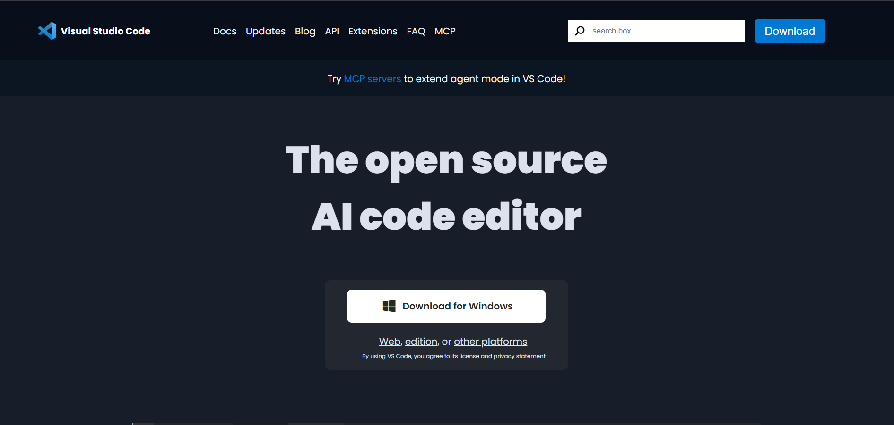
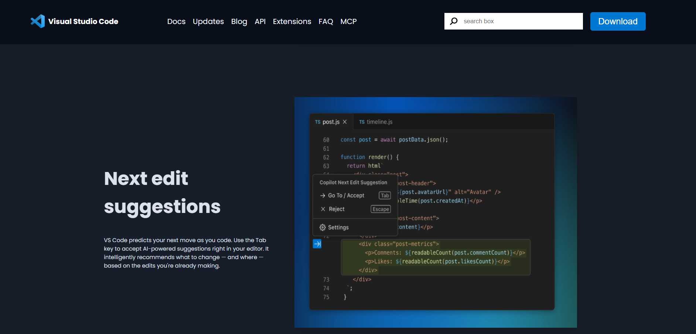

# VS Code Landing Page 💻

A **clean and minimal landing page** inspired by **Visual Studio Code** UI, built using **HTML & CSS**.  
This project demonstrates frontend design skills by replicating VS Code’s look for practice and portfolio.

---

## Features
- Minimalistic design inspired by VS Code’s official website  
- Header with logo and navigation links  
- Hero section with promotional text and call-to-action buttons  
- Static desktop layout only — **not responsive**  
- Pure HTML & CSS, no JavaScript  

---

## Live Demo
Check it out here: [VS Code Landing Page](https://notsomohit7.github.io/VScode_LandingPage_Clone/)

---

## How to Run Locally
1. Clone the repository:  
   ```bash
   git clone https://github.com/notsomohit7/VScode_LandingPage_Clone.git
   cd VScode_LandingPage_Clone
## Folder Structure  
vscode-landing-page/

├── index.html

├── style.css

├── materials/         # Additional assets & files

└── README.md

## here are some screenshots of the website
<div style="display: flex; flex-direction: column; gap: 15px; overflow-x: auto;">   </div> ```
